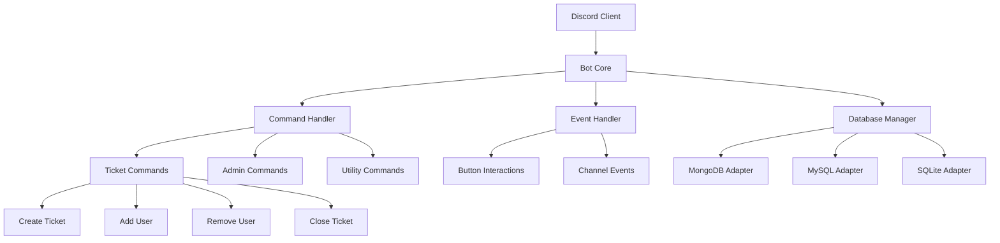

# Design Document

## Overview

The Discord Ticket Bot is a Python-based application built using the discord.py library that provides a comprehensive ticket management system for Discord servers. The bot follows a modular architecture with separate command files, supports multiple database backends, and implements a user-friendly interface through embeds and buttons for ticket operations.

## Architecture

### High-Level Architecture



### Core Components

1. **Bot Core**: Main application entry point and Discord client management
2. **Command System**: Modular command loading and execution
3. **Database Layer**: Abstracted database operations with multiple backend support
4. **Ticket Manager**: Core ticket lifecycle management
5. **Configuration Manager**: Bot settings and server-specific configurations
6. **Logging System**: Comprehensive logging for debugging and audit trails

## Components and Interfaces

### Bot Core (`bot.py`)

```python
class TicketBot(commands.Bot):
    def __init__(self):
        # Initialize bot with intents and configuration
        
    async def setup_hook(self):
        # Load cogs, sync commands, initialize database
        
    async def load_extensions(self):
        # Dynamically load all command modules
```

### Database Manager (`database/manager.py`)

```python
class DatabaseManager:
    def __init__(self, db_type: str, connection_string: str):
        # Initialize database connection based on type
        
    async def get_adapter(self) -> DatabaseAdapter:
        # Return appropriate database adapter
        
class DatabaseAdapter(ABC):
    @abstractmethod
    async def create_ticket(self, ticket_data: dict) -> str:
        # Create new ticket record
        
    @abstractmethod
    async def get_ticket(self, ticket_id: str) -> dict:
        # Retrieve ticket information
        
    @abstractmethod
    async def update_ticket(self, ticket_id: str, updates: dict):
        # Update ticket status/information
        
    @abstractmethod
    async def close_ticket(self, ticket_id: str):
        # Mark ticket as closed
```

### Ticket Manager (`core/ticket_manager.py`)

```python
class TicketManager:
    def __init__(self, bot, db_manager):
        # Initialize with bot instance and database manager
        
    async def create_ticket(self, user: discord.Member, guild: discord.Guild) -> discord.TextChannel:
        # Create new ticket channel and database record
        
    async def add_user_to_ticket(self, channel: discord.TextChannel, user: discord.Member, staff: discord.Member):
        # Add user to existing ticket
        
    async def remove_user_from_ticket(self, channel: discord.TextChannel, user: discord.Member, staff: discord.Member):
        # Remove user from ticket
        
    async def close_ticket(self, channel: discord.TextChannel, staff: discord.Member):
        # Close ticket and create transcript
```

### Command Structure

Commands are organized into separate cogs for modularity:

- `commands/ticket_commands.py`: Core ticket operations (new, add, remove, close)
- `commands/admin_commands.py`: Administrative functions (setup, config)
- `commands/utility_commands.py`: Helper commands (help, status)

### Configuration System (`config/config_manager.py`)

```python
class ConfigManager:
    def __init__(self):
        # Load configuration from file/environment
        
    def get_guild_config(self, guild_id: int) -> GuildConfig:
        # Get server-specific configuration
        
class GuildConfig:
    staff_roles: List[int]
    ticket_category: int
    log_channel: int
    database_config: dict
    embed_settings: dict
```

## Data Models

### Ticket Model

```python
@dataclass
class Ticket:
    ticket_id: str
    guild_id: int
    channel_id: int
    creator_id: int
    status: TicketStatus
    created_at: datetime
    closed_at: Optional[datetime]
    assigned_staff: List[int]
    participants: List[int]
    transcript_url: Optional[str]
    
enum TicketStatus:
    OPEN = "open"
    CLOSED = "closed"
    ARCHIVED = "archived"
```

### Database Schema

#### MongoDB Schema
```javascript
{
  _id: ObjectId,
  ticket_id: String,
  guild_id: Number,
  channel_id: Number,
  creator_id: Number,
  status: String,
  created_at: Date,
  closed_at: Date,
  assigned_staff: [Number],
  participants: [Number],
  transcript_url: String
}
```

#### SQL Schema (MySQL/SQLite)
```sql
CREATE TABLE tickets (
    id INTEGER PRIMARY KEY AUTOINCREMENT,
    ticket_id VARCHAR(50) UNIQUE NOT NULL,
    guild_id BIGINT NOT NULL,
    channel_id BIGINT NOT NULL,
    creator_id BIGINT NOT NULL,
    status VARCHAR(20) DEFAULT 'open',
    created_at TIMESTAMP DEFAULT CURRENT_TIMESTAMP,
    closed_at TIMESTAMP NULL,
    transcript_url TEXT NULL
);

CREATE TABLE ticket_participants (
    ticket_id VARCHAR(50),
    user_id BIGINT,
    role VARCHAR(20), -- 'creator', 'staff', 'participant'
    added_at TIMESTAMP DEFAULT CURRENT_TIMESTAMP,
    FOREIGN KEY (ticket_id) REFERENCES tickets(ticket_id)
);
```

## Error Handling

### Error Categories

1. **Database Errors**: Connection failures, query errors, data integrity issues
2. **Discord API Errors**: Rate limiting, permission errors, channel creation failures
3. **User Input Errors**: Invalid commands, insufficient permissions, duplicate actions
4. **Configuration Errors**: Missing settings, invalid role/channel IDs

### Error Handling Strategy

```python
class TicketBotError(Exception):
    """Base exception for ticket bot errors"""
    pass

class DatabaseError(TicketBotError):
    """Database operation errors"""
    pass

class PermissionError(TicketBotError):
    """User permission errors"""
    pass

class ConfigurationError(TicketBotError):
    """Configuration-related errors"""
    pass

# Error handler decorator
def handle_errors(func):
    async def wrapper(*args, **kwargs):
        try:
            return await func(*args, **kwargs)
        except TicketBotError as e:
            # Log error and send user-friendly message
            await send_error_embed(ctx, str(e))
        except Exception as e:
            # Log unexpected errors
            logger.error(f"Unexpected error: {e}")
            await send_generic_error(ctx)
    return wrapper
```

### Retry Logic

- Database operations: 3 retries with exponential backoff
- Discord API calls: Built-in discord.py retry handling
- File operations: 2 retries for transcript generation

## Testing Strategy

### Unit Testing

- **Database Adapters**: Test CRUD operations for each database type
- **Ticket Manager**: Test ticket lifecycle operations
- **Command Logic**: Test command parsing and execution
- **Configuration**: Test config loading and validation

### Integration Testing

- **Database Integration**: Test with actual database instances
- **Discord Integration**: Test with Discord test server
- **End-to-End Flows**: Test complete ticket workflows

### Test Structure

```
tests/
├── unit/
│   ├── test_database_adapters.py
│   ├── test_ticket_manager.py
│   ├── test_commands.py
│   └── test_config.py
├── integration/
│   ├── test_database_integration.py
│   ├── test_discord_integration.py
│   └── test_workflows.py
└── fixtures/
    ├── mock_discord.py
    └── test_data.py
```

### Testing Tools

- **pytest**: Primary testing framework
- **pytest-asyncio**: For testing async functions
- **unittest.mock**: For mocking Discord objects and database connections
- **docker-compose**: For spinning up test databases

### Performance Testing

- **Load Testing**: Simulate multiple concurrent ticket operations
- **Database Performance**: Test query performance with large datasets
- **Memory Usage**: Monitor bot memory consumption over time

## Security Considerations

### Permission Validation

- Verify user roles before allowing ticket operations
- Implement rate limiting for ticket creation
- Validate channel permissions before operations

### Data Protection

- Sanitize user input in database queries
- Encrypt sensitive configuration data
- Implement secure transcript storage

### Access Control

- Role-based access control for administrative functions
- Channel-level permissions for ticket access
- Audit logging for all ticket operations